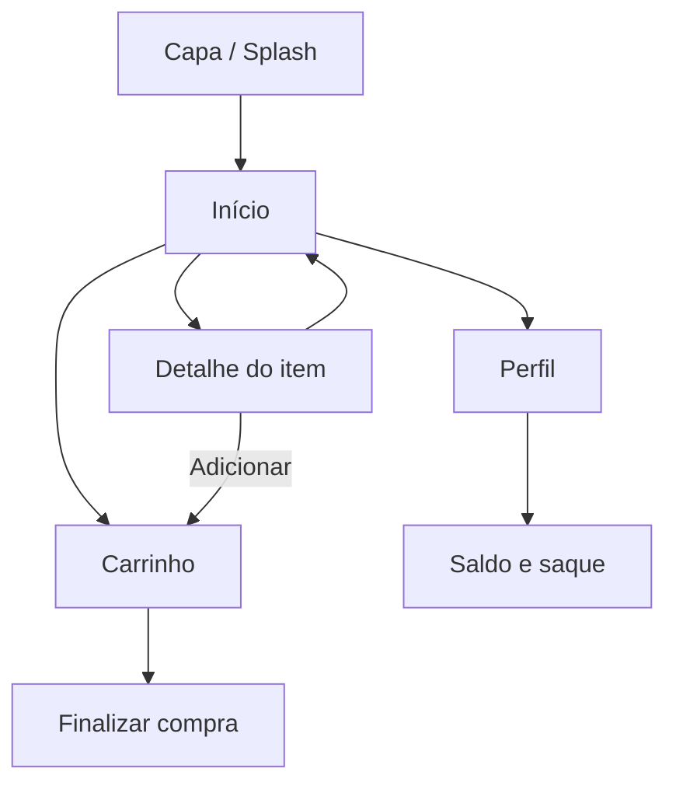

# Dneyson Business — Esquemas do App

Documento de referência com o fluxo de telas, os wireframes de cada tela, a paleta visual e a estrutura de dados. Use isso como guia ao montar o app no FlutterFlow.

---

## 1. Fluxo de navegação



- **Capa** aparece uma vez ao abrir o app, com botão "Começar"
- **Início, Carrinho e Perfil** ficam na barra inferior, sempre acessíveis
- **Detalhe do item** abre por cima da Início e volta pra ela

---

## 2. Wireframes de cada tela

### 2.1 Capa (Splash)
```
┌─────────────────────────┐
│ 9:41            ▪▪▪▪ 🔋 │
│                          │
│                          │
│         ( D )            ← logo circular, dourado
│    Dneyson Business       ← título, 2 linhas
│  "Produtos, cursos e      ← subtítulo
│   serviços em uma vitrine"│
│                          │
│   [📦]  [🎓]  [🔧]        ← ícones das 3 categorias
│                          │
│  ┌────────────────────┐ │
│  │      Começar        │ │ ← botão dourado, largura total
│  └────────────────────┘ │
│      v0.1 · protótipo    │
└─────────────────────────┘
```

### 2.2 Início (Home)
```
┌─────────────────────────┐
│ 9:41            ▪▪▪▪ 🔋 │
│ Dneyson Business    (👤) │
│                          │
│        ( D )              ← hub central
│  sua vitrine, 3 formas    │
│  [📦]   [🎓]   [🔧]       ← categorias (orbit)
│ Produtos Cursos Serviços  │
│                          │
│ 🔍 Buscar produtos...    │
│                          │
│ Em destaque      ver tudo│
│ ┌────────┐ ┌────────┐   │
│ │ item 1 │ │ item 2 │   │
│ │ ★4.8   │ │ ★4.9   │   │
│ │ R$49,90│ │ R$129,0│   │
│ └────────┘ └────────┘   │
│ ┌────────┐ ┌────────┐   │
│ │ item 3 │ │ item 4 │   │
│ └────────┘ └────────┘   │
│                          │
│ [🏠 Início] [🛍 Carrinho] [👤 Perfil] │
└─────────────────────────┘
```

### 2.3 Detalhe do item
```
┌─────────────────────────┐
│ 9:41            ▪▪▪▪ 🔋 │
│ (←)                      │
│ ┌──────────────────────┐│
│ │      [ícone grande]   ││ ← imagem/ícone do item
│ └──────────────────────┘│
│ [tag categoria]          │
│ Título do item            │
│ ★4.8 · vendido por Fulano │
│ Descrição do item em 2-3  │
│ linhas explicando o que é.│
│                          │
│  valor         [Adicionar│
│  R$ 49,90       ao carrinho]│
└─────────────────────────┘
```
> O texto do botão muda: "Adicionar ao carrinho" (produto) · "Matricular-se" (curso) · "Agendar" (serviço)

### 2.4 Carrinho
```
┌─────────────────────────┐
│ 9:41            ▪▪▪▪ 🔋 │
│ Seu carrinho              │
│                          │
│ [ícone] Item 1      🗑   │
│  R$49,90   (- 1 +)       │
│                          │
│ [ícone] Item 2      🗑   │
│  R$129,00                │
│                          │
│ Total         R$178,90    │
│ ┌────────────────────┐  │
│ │  Finalizar compra    │  │
│ └────────────────────┘  │
└─────────────────────────┘
```

### 2.5 Perfil
```
┌─────────────────────────┐
│ 9:41            ▪▪▪▪ 🔋 │
│ (👤) Sua conta            │
│                          │
│ ┌──────────────────────┐│
│ │ saldo disponível       ││
│ │ R$ 342,50      [Sacar]││
│ └──────────────────────┘│
│                          │
│ Meus pedidos              │
│ Meus cursos                │
│ Agenda de serviços          │
│ Dados da conta              │
│ Vender no Dneyson Business  │
└─────────────────────────┘
```

---

## 3. Paleta e tipografia

| Uso | Cor | Hex |
|---|---|---|
| Fundo escuro / textos principais | Tinta (ink) | `#1C1730` |
| Fundo claro | Papel (paper) | `#FBF8F2` |
| Destaque / botões principais | Dourado (gold) | `#E7A23D` |
| Categoria "Produtos" | Índigo | `#342A63` |
| Categoria "Cursos" | Verde-azulado | `#2F8F7E` |
| Categoria "Serviços" | Coral | `#E2615C` |

- **Título/destaque:** fonte Sora (negrito, arredondada, moderna)
- **Texto corrido:** fonte Inter

---

## 4. Estrutura de dados (coleções no Firebase)

### `usuarios`
| campo | tipo | observação |
|---|---|---|
| id | string | gerado automaticamente |
| nome | string | |
| email | string | |
| tipo | string | "comprador" ou "vendedor" |
| saldo | number | saldo disponível para saque |

### `itens`
| campo | tipo | observação |
|---|---|---|
| id | string | |
| titulo | string | |
| tipo | string | "produto", "curso" ou "servico" |
| preco | number | |
| descricao | string | |
| vendedor_id | referência | liga a `usuarios` |
| avaliacao | number | média de estrelas |
| imagem_url | string | |

### `pedidos`
| campo | tipo | observação |
|---|---|---|
| id | string | |
| comprador_id | referência | |
| itens | lista | id do item + quantidade |
| total | number | |
| status | string | "pendente", "pago", "concluído" |
| data | timestamp | |

### `carrinho` (opcional — pode ficar só local no app)
| campo | tipo | observação |
|---|---|---|
| usuario_id | referência | |
| item_id | referência | |
| quantidade | number | |

---

## 5. Componentes reutilizáveis (para montar uma vez e repetir)

- **Cartão de item** — usado na Início (grade 2 colunas)
- **Barra inferior de navegação** — Início / Carrinho / Perfil, com contador no ícone do carrinho
- **Botão de ação principal** — pílula dourada, texto muda conforme contexto
- **Cartão de saldo** — fundo escuro, valor em dourado, botão "Sacar"

---

*Este documento acompanha o protótipo visual `app-vendas-prototipo.jsx`, que mostra esses esquemas já funcionando na tela.*
